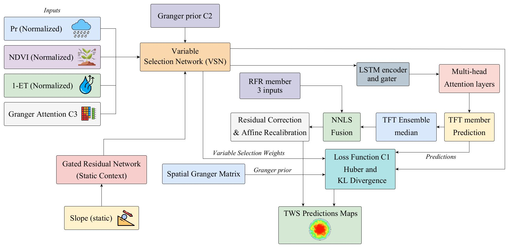

# Causal-Guided Temporal Fusion Transformer for Downscaling Terrestrial Water Storage

Reproducibility repository for the paper:

> **Causal-Guided Temporal Fusion Transformer for Downscaling Terrestrial Water Storage Data: Case of the Tensift River Basin, Morocco**  
> Anasse Boutayeb, Iyad Lahsen-Cherif, Ahmed El Khadimi, and Manal Abbassi  
> *Submitted to the Green MM Workshop, 34th ACM International Conference on Multimedia (ACM MM '26), Rio de Janeiro, Brazil.*

This repository implements a causal-guided framework for spatially downscaling GLDAS Terrestrial Water Storage (TWS) data from `0.25°` to `0.05°` over the Tensift River basin in Morocco.

The proposed method combines:

- a spatially explicit Granger-causality structure;
- a Temporal Fusion Transformer (TFT);
- a Random Forest Regressor (RFR);
- non-negative least-squares (NNLS) fusion;
- affine recalibration on validation data.

All reported results are obtained using **5-Fold Stratified Cross-Validation**. The values presented below correspond to the averages across the five folds, with the RMSE additionally reported as `mean ± standard deviation`.

---

## Pipeline



Three complementary causal-guidance mechanisms are injected directly into the TFT block:

- **C1 - Causal loss regularization:** Kullback-Leibler divergence between the TFT variable-selection weights and the Granger prior is added to the Huber loss.
- **C2 - Causal prior in variable selection:** the Granger prior biases the variable-selection logits.
- **C3 - Granger attention as an additional pathway:** a spatially varying Granger-attention map is appended as a fourth temporal channel alongside `Pr`, `NDVI`, and `1 - ET`.

Granger matrices are independently estimated for each hydro-climatic zone using K-means clustering and multi-lag Akaike Information Criterion weighting, with a maximum lag of five days. Three hydro-climatic zones are retained according to the silhouette score.

The TFT component is a nine-member ensemble initialized with different random seeds and aggregated through the median. Terrain slope is introduced as a static contextual variable through a Gated Residual Network. The final prediction is obtained as:

```text
TWS = w1 * TFT + w2 * RFR
```

where the NNLS-estimated weights are `w1 = 0.854` and `w2 = 0.138`. An affine recalibration is retained only when it reduces the validation RMSE.

---

## Repository layout

```text
causal-guided-tft-tws/
├── README.md
├── assets/
│   └── workflow.jpg
├── src/
│   ├── GRSL_v12.py
│   ├── ABLATION_TFT_RFR_C1.py
│   ├── ABLATION_TFT_RFR_C1_C2.py
│   ├── ABLATION_TFT_RFR_corr.py
│   ├── ABLATION_TFT_RFR_uniform.py
│   ├── SOTA_LightGBM.py
│   ├── SOTA_RFR.py
│   ├── SOTA_SVR.py
│   ├── SOTA_TFT.py
│   ├── SOTA_XGBoost.py
│   ├── ablation_common.py
│   ├── sota_common.py
│   └── subgrid_common.py
└── notebooks/
    ├── GRSL_v12.ipynb
    ├── ABLATION_TFT_RFR_C1.ipynb
    ├── ABLATION_TFT_RFR_C1_C2.ipynb
    ├── ABLATION_TFT_RFR_corr.ipynb
    ├── ABLATION_TFT_RFR_uniform.ipynb
    ├── SOTA_LightGBM.ipynb
    ├── SOTA_RFR.ipynb
    ├── SOTA_SVR.ipynb
    ├── SOTA_TFT.ipynb
    └── SOTA_XGBoost.ipynb
```

The helper modules `ablation_common.py`, `sota_common.py`, and `subgrid_common.py` centralize the common data-preparation, coarse-grid aggregation, raster-export, evaluation, and sub-grid variability procedures used by the benchmark and ablation experiments.

---

## Input data

All inputs are downloaded through the Google Earth Engine API, projected onto a common WGS84 `0.05°` grid, and clipped to the Tensift River basin.

- **TWS:** GLDAS CLSM, native resolution `0.25°`, daily frequency, asset `NASA/GLDAS/V022/CLSM/G025/DA1D`.
- **API precipitation:** CHIRPS, resolution `0.05°`, daily frequency, asset `UCSB-CHG/CHIRPS/DAILY`.
- **Evapotranspiration:** MODIS MOD16A2GF, native resolution `500 m`, 8-day frequency, asset `MODIS/061/MOD16A2GF`.
- **NDVI:** MODIS MOD13Q1, native resolution `250 m`, 16-day frequency, asset `MODIS/061/MOD13Q1`.
- **Terrain slope:** static layer derived from the SRTM digital terrain model.

Linear temporal interpolation is applied to the 8-day and 16-day MODIS products. A hierarchical gap-filling procedure is used inside the basin domain mask to handle missing pixels.

### Expected folder layout

```text
Project_Tensift/
├── TWS_GLDAS_Clipped/
├── CHIRPS_GEE_Clipped/
├── MODIS_NDVI_GEE_Clipped/
├── MODIS_ET_GEE_Clipped/
├── Slope_Tensift.tif
└── Tensift.shp
```

The shapefile must be accompanied by its associated `.shx`, `.dbf`, and `.prj` files.

---

## Study period and validation protocol

The study covers **31 March 2023 to 30 October 2025**, corresponding to **944 daily dates**.

The experimental protocol uses an `80% / 20%` train-test partition within a **5-Fold Stratified Cross-Validation** procedure. The split is repeated across five folds while preserving the representative distribution of the observations. Final scores are obtained by averaging the fold-level results.

At each fold:

1. The models are trained using the corresponding training partition.
2. Hyperparameters and ensemble coefficients are determined using validation data that remain unseen during training.
3. The `0.05°` predictions are area-weighted and aggregated to the native `0.25°` GLDAS grid.
4. Aggregated predictions are compared with the original GLDAS TWS reference.
5. Sub-grid variability is calculated directly from the `0.05°` predictions.

The evaluation uses:

- **RMSE:** prediction error in millimetres;
- **R²:** explained variance of the reference TWS;
- **Pearson's r:** linear agreement with the reference TWS;
- **Mean sub-grid standard deviation (`sigma_bar`):** spatial variability generated among the `0.05°` sub-pixels inside each `0.25°` cell.

---

## Running the notebooks in Google Colab

Each notebook follows the same general procedure:

1. Install the required Python packages.
2. Mount Google Drive.
3. Clone this repository.
4. Set `DATA_ROOT` to the folder containing `Project_Tensift/`.
5. Import the corresponding Python module.
6. Run the module's `main()` function.

For TFT-based experiments, including the proposed model, ablation variants, and standalone TFT, use a GPU runtime such as an NVIDIA T4:

```text
Runtime -> Change runtime type -> T4 GPU
```

The RFR, XGBoost, LightGBM, and SVR benchmarks can be executed on CPU.

---

## Results

The following single table combines the benchmark comparison and the complete ablation study. Results are based on **5-Fold Stratified Cross-Validation**. RMSE is reported as the fold mean and standard deviation.

| Evaluation | Model | RMSE (mm) | R² (%) | r (%) | sigma_bar (mm) |
|---|---|---:|---:|---:|---:|
| Main benchmark | SVR | 59.18 ± 4.37 | 55.31 | 74.34 | 26.91 |
| Main benchmark | XGBoost | 28.74 ± 2.63 | 89.47 | 94.58 | 35.12 |
| Main benchmark | LightGBM | 30.96 ± 2.81 | 87.76 | 93.68 | 34.71 |
| Main benchmark | Classical RFR | 42.58 ± 3.46 | 76.87 | 87.66 | 26.74 |
| Main benchmark | Standalone TFT | 48.61 ± 4.12 | 69.84 | 83.53 | 19.42 |
| Main benchmark | Standard TFT + RFR fusion | 44.73 ± 3.77 | 74.48 | 86.26 | 15.08 |
| Ablation study | TFT + RFR, uniform weights | 11.94 ± 1.28 | 98.18 | 99.08 | 14.21 |
| Ablation study | TFT + RFR, correlation matrix | 11.17 ± 1.19 | 98.41 | 99.20 | 8.91 |
| Ablation study | TFT + RFR + C1 | 9.36 ± 0.96 | 98.88 | 99.44 | 8.27 |
| Ablation study | TFT + RFR + C1 + C2 | 7.39 ± 0.78 | 99.30 | 99.65 | 6.28 |
| Ablation study | **Full model: C1 + C2 + C3** | **5.68 ± 0.62** | **99.59** | **99.79** | **4.78** |

The progressive reduction in RMSE from the uniform-weight fusion to the full model demonstrates the contribution of the spatial Granger structure, causal variable-selection prior, KL regularization, and additional Granger-attention channel.

---

## Retained hyperparameters

The main retained parameters are:

- **RFR:** 800 estimators, maximum depth 25, minimum split size 20, minimum leaf size 10, maximum feature fraction 0.357, and maximum sample fraction 0.75.
- **TFT:** four attention heads, sequence length 60, 60 epochs, and dropout 0.1.
- **Causal prior:** prior strength `gamma = 0.5` and maximum Granger lag `L_max = 5`.
- **Ensemble:** nine TFT members and NNLS weights `(0.854, 0.138)`.
- **Hydro-climatic stratification:** three zones.
- **Residual correction coefficient:** `beta = 0.0`.

Gaussian-process-based Bayesian optimization is used for the RFR member and benchmark models. The search relies on the expected-improvement acquisition criterion.

---

## Sub-grid variability

The mean sub-grid standard deviation measures the spatial variability generated by the downscaled product within each original GLDAS cell.

A trivial replication of the coarse value across all fine sub-pixels produces a value approaching zero. A strictly positive value indicates that the model generates non-uniform spatial structure at `0.05°`. This metric complements RMSE, R², and Pearson's correlation because the latter are calculated after aggregation to the native `0.25°` resolution.

---

## Future extensions

Potential extensions include:

- validation against in-situ piezometric measurements;
- integration of additional environmental and climatic variables;
- conditional Generative Adversarial Networks;
- Graph Neural Networks for modelling complex causal interactions between hydro-climatic zones.

---

## Contact

**Anasse Boutayeb**  
Institut National des Postes et des Télécommunications (INPT)  
boutayebanasse@gmail.com
Rabat, Morocco  
Email: `boutayebanasse@gmail.com`
